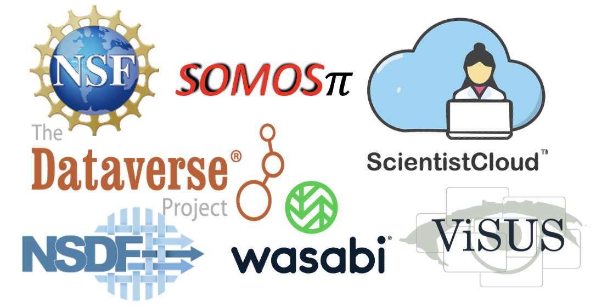

# **NSDF Tutorial: Using NSDF for End-to-End Analysis of Scientific Data - Earth Science**


<p align="center">
    
</p>

<p align="center">
<a href="https://www.python.org/downloads/release/python-310/"></a>
<a href="https://opensource.org/licenses/Apache-2.0"></a>
<a href="https://nsdf-workspace.slack.com/"></a>
<a href="https://www.docker.com"></a>
<a href="https://github.com/astral-sh/ruff"></a>
<a href="https://doi.org/10.5281/zenodo.10794642"></a>
<a href="https://dl.acm.org/doi/10.1145/3588195.3595941"></a>
<a href="https://research.ibm.com/publications/enabling-scalability-in-the-cloud-for-scientific-workflows-an-earth-science-use-case"></a>
<a href="https://ieeexplore.ieee.org/document/9041768"></a>
<a href="http://doi.org/10.1145/582034.582036"></a>
<a href="https://www.taylorfrancis.com/chapters/edit/10.1201/b12985-32/visus-visualization-frame[…]a-gyulassy-cameron-christensen-sujin-philip-sidharth-kumar"></a>
<a href="https://doi.org/10.1145/1944846.1944847"></a>
</p>


## Overview

This tutorial introduces the <a href="https://nationalsciencedatafabric.org/" target="_blank" rel="noreferrer">NSDF</a> ecosystem, which enhances scientific data access, analysis, and visualization through cloud technologies. It provides step-by-step guidance using a module of the [SOMOSPIE](https://globalcomputing.group/somospie/) engine called [GEOtiled](https://github.com/TauferLab/GEOtiled) to retrieve raw data from public sources, such as the [USGS](https://www.usgs.gov/) portal and efficiently computes terrain attributes from digital elevation models (DEMs) across large geographic areas while preserving accuracy. The data is processed into multiple files for analysis using NSDF services and stored across both public and private platforms.

By the end of the tutorial, you will learn how to:

- **Build a modular workflow** that integrates your application with NSDF services

- **Upload, download, and stream data** across **public and private storage** platforms

- Use the NSDF dashboard for **large-scale data access, visualization, and analysis**.

You can download the introductory slides [here](https://drive.google.com/file/d/16IKgoejeKarthKd4u6rWI52I2Gu4AChb/view?usp=sharing). The tutorial follows the process shown in Figure 1.

<p align="center">
    
    <br>
    <em>Figure 1. Workflow diagram illustrating the tutorial's process of data collection, transformation, analysis, and storage using the SOMOSPIE engine and NSDF services.</em>
</p>

---

## Table of contents

1. [Running the Tutorial](#running-the-tutorial)
2. [Option 1: GitHub Codespaces (Recommended)](#option-1-GitHub-codespaces-recommended)
3. [Option 2: Docker](#0ption-2-docker)
4. [APPENDIX: Prerequities for Docker](#appendix-prerequities-for-docker)
5. [Community and Resources](#community-and-resources)
7. [Publications](#publications)
8. [Copyright and License](#copyright-and-license)
9. [Authors](#authors)
10. [Acknowledgments](#acknowledgments)


## Running the Tutorial
This tutorial can be executed in two different environments:

- GitHub Codespaces – a cloud-based development environment that requires no local installation beyond a GitHub account.

- Docker – a container-based approach that requires Git and Docker installed on your local machine.

You can choose one of the two options below based on your preferred setup.


## Option 1: GitHub Codespaces (Recommended)
  <p><strong>Requirements:</strong> A GitHub account. No software installation required.</p>
  <p>
    <a href="https://github.com/codespaces/new/TauferLab/NSDF-Tutorial-2025?devcontainer_path=.devcontainer/session+II/devcontainer.json">
       
    </a> <= Click here to take you to create a new codespace
  </p>
  <ol>
    <li>Repository: <code>TauferLab/NSDF-Tutorial-2025</code>.</li>
    <li>Use the <strong>main</strong> branch of the repository.</li>
    <li>Dev container: <code>NSDF Tutorial – Session II</code>.</li>
    <li>Click <strong>Create Codespace</strong>.</li>
  </ol>
  <p>This process may take a few minutes. Once ready, run <code>Hands-on/session II/Tutorial.ipynb</code> in Jupyter.</p>
  <div align="center">
    
    <br><em>Figure 1. Creating GitHub Codespaces</em>
  </div>
  <div align="center">
    
    <br><em>Figure 2. Setting up your Codespace</em>
  </div>
  <div align="center">
    
    <br><em>Figure 3. VS Code interface in Codespaces</em>
  </div>
  After the creation of the codespace, proceed to Session II by clicking in the file <a href="./1.Tutorial.ipynb">hands-on/session II/1.Tutorial.ipynb</a> 
  <div align="center">
    
    <br><em>Figure 4. Opening the tutorial file</em>
  </div>

## Option 2: Docker
  <p><strong>Requirements:</strong> Git, Docker Desktop (v4.15.10 or newer), 8 GB RAM, 5 GB disk space (See Appendix for more information on the installation.</p>
  <ol>
    <li>
      <a href="https://github.com/git-guides/install-git">Install Git</a> and
      <a href="https://docs.docker.com/engine/install/">Install Docker Desktop</a>
    </li>
    <li>Open Docker Desktop before continuing.</li>
    <li>Open terminal and run:
      <pre><code>git clone https://github.com/TauferLab/NSDF-Tutorial-2025.git
cd NSDF-Tutorial-2025/session\ II/Materials/
docker-compose up -d</code></pre>
    </li>
    <li>Open <a href="http://127.0.0.1:5000/lab/tree/Tutorial.ipynb">http://127.0.0.1:5000/lab/tree/Tutorial.ipynb</a> in a browser.</li>
    <li>To stop the container:
      <pre><code>docker-compose down</code></pre>
    </li>
  </ol>


## APPENDIX: Prerequisites

> :bulb: ONLY IF YOU RUN THE TUTORIAL WITH DOCKER
 
To install Git and Docker Desktop on your computer, follow these steps:

- **To install Git**: Follow the [installation instructions](https://github.com/git-guides/install-git) for your operating system (Linux, Windows, or Mac).
- **To install Docker Desktop**: Follow the [installation instructions](https://docs.docker.com/engine/install/) for your operating system (Linux, Windows, or Mac). -
- **_Be sure you are running the most recent version of Docker! Previous versions to 4.15.10 may not work._**

After installation, confirm that both tools are correctly set up by executing the following commands in your terminal.

> :bulb: **Note:** For Windows users, we recommend using the [PowerShell](https://learn.microsoft.com/en-us/powershell/scripting/overview?view=powershell-7.4) terminal for these verifications.

- To verify the GitHub installation:

```
# Check the Git version
git --version
```

Expected output (NOTE: git version can be different):

```
git version 3.12.0
```

- To verify Docker Desktop installation: Open the Docker Desktop application before running Docker commands.

```
# Check the Docker installation information
docker info
```

Expected output:

```
Client:
 Version:    24.0.5
 Context:    default
 Debug Mode: false

Server:
 Containers: 120
  Running: 0
  Paused: 0
  Stopped: 120
 Images: 48
```

> :bulb: **Note:** The specific numbers in the output might vary based on your installation details and additional information may also appear.

<h3>Using Docker</h3>
<pre><code>cd Materials
docker build --platform linux/amd64 -t globalcomputinglab/somospie_openvisus .
docker pull --platform linux/amd64 globalcomputinglab/somospie_openvisus:tutorial
docker run -d -p 5000:5000 -p 8989:8989 --name tutorial --platform linux/amd64 globalcomputinglab/somospie_openvisus</code></pre>
<p>Visit: <code>http://localhost:5000/</code></p>

<h3>Using Your Local Machine</h3>
<ol>
    <li>Install <a href="https://www.anaconda.com/download/">Conda</a></li>
    <li>Run:
      <pre><code>cd Materials
conda env create -f environment.yml
conda activate NSDF-Tutorial
cd GEOtiled/geotiled
pip install -e .
./setup_openvisuspy.sh
jupyter notebook Tutorial.ipynb</code></pre>
    </li>
</ol>

## Community and Resources:

NSDF and SOMOSPIE are open-source projects. Questions, discussions, and contributions are welcome. Contributions can include new packages, bug fixes, documentation, or even new core features.


NSDF Resources:

- **Slack workspace**: [nsdf-workspace](https://nsdf-workspace.slack.com/).
- **Github Discussions**: [issues](https://github.com/nsdf-fabric/catalog-comparison-tool/issues): Discussions and Q&A.
- **Mailing list**: [https://groups.google.com/g/nsdf](https://groups.google.com/g/nsdf) - nsdf@googlegroups.com
- **LinkedIN**: [LinkedIn](https://www.linkedin.com/company/76216771/admin/dashboard/)) 

OpenVisus Resources:

- **Github:** [Open Source distribution of the ViSUS capabilities](https://github.com/sci-visus/openvisus)
- **Webpage:** [VISUS - High performance Big Data Analysis and Visualization Solutions](https://visus.org/)

SOMOSPIE Resources:

- **GitHub:** [SOMOSPIE software](https://github.com/TauferLab/SOMOSPIE)
- **Webpage:** [SOMOSPIE overview](https://globalcomputing.group/somospie)
- **Questions:** Michela Taufer [mtaufer@utk.edu](email:mtaufer@utk.edu)

GEOtiled Resources:

- **GitHub:** [GEOtiled software](https://github.com/TauferLab/GEOtiled)
- **Webpage:** [GEOtiled overview](https://github.com/TauferLab/GEOtiled)
- **Questions:** Michela Taufer [mtaufer@utk.edu](email:mtaufer@utk.edu)


## Publications

[1] Roa, C., Olaya, P., Llamas, R., Vargas, R., Taufer, M. GEOtiled: A Scalable Workflow for Generating Large Datasets of High-Resolution Terrain Parameters. Proceedings of the 32nd International Symposium on High-Performance Parallel and Distributed Computing (2023). [link](https://dl.acm.org/doi/abs/10.1145/3588195.3595941)

[2] Olaya, Paula, and Luettgau, Jakob, and Roa, Camila, and Llamas, Richardo, and Vargas, Rodrigo, and Wen, Sophia, and Chung, I-Hsin, and Seelam, Seetharami, and Park, Yoonho, and Lofstead, Jay, and others. Enabling Scalability in the Cloud for Scientific Workflows: An Earth Science Use Case. IEEE International Conference on Cloud Computing (2023). [link](https://research.ibm.com/publications/enabling-scalability-in-the-cloud-for-scientific-workflows-an-earth-science-use-case)

[3] D. Rorabaugh, M. Guevara, R. Llamas, J. Kitson, R. Vargas, and M. Taufer. SOMOSPIE: A modular SOil MOisture SPatial Inference Engine based on data-driven decisions. In Proceedings of the 2019 15th International Conference on eScience (eScience) (2019). [link](https://ieeexplore.ieee.org/document/9041768)

[4] V. Pascucci and R. J. Frank, "Global Static Indexing for Real-Time Exploration of Very Large Regular Grids," SC '01: Proceedings of the 2001 ACM/IEEE Conference on Supercomputing, Denver, CO, USA, 2001, pp. 45-45, [link](http://doi.org/10.1145/582034.582036)

[5] Pascucci, Valerio, et al. "The ViSUS visualization framework." High Performance Visualization. Chapman and Hall/CRC, 2012. 439-452. [link](https://www.taylorfrancis.com/chapters/edit/10.1201/b12985-32/visus-visualization-frame[…]a-gyulassy-cameron-christensen-sujin-philip-sidharth-kumar)

[6] Brian Summa, Giorgio Scorzelli, Ming Jiang, Peer-Timo Bremer, and Valerio Pascucci. 2011. Interactive editing of massive imagery made simple: Turning Atlanta into Atlantis. ACM Trans. Graph. 30, 2, Article 7 (April 2011), 13 pages. [link](https://doi.org/10.1145/1944846.1944847)


## Copyright and License

Copyright (c) 2024, Global Computing Lab

Catalog Comparison Tool is distributed under the terms of the [Apache License, Version 2.0](http://www.apache.org/licenses/LICENSE-2.0) with LLVM Exceptions.
See [LICENSE](Materials/LICENSE) for more details.


## Authors

This project was created by the [NSDF team](https://nationalsciencedatafabric.org/contributors.html) and the SOMOSPIE team. To reach out email us at [info@nationalsciencedatafabric.org](email:info@nationalsciencedatafabric.org) and Dr. Michela Taufer [mtaufer@utk.edu](email:mtaufer@utk.edu).


## Acknowledgments

The authors of this tutorial would like to express their gratitude to:

- NSF through the awards 2138811, 2103845, 2334945, 2138296, and 2331152.
- The Dataverse team [link](https://dataverse.org/about)
- Vargas Lab led by Dr. Rodrigo Vargas [link](https://www.udel.edu/academics/colleges/canr/departments/plant-and-soil-sciences/faculty-staff/rodrigo-vargas/)

Any opinions, findings, conclusions, or recommendations expressed in this material are those of the author(s) and do not necessarily reflect the views of the National Science Foundation.


<!-- 
  <ul>
    <li><a href="https://nsdf-workspace.slack.com/">Slack workspace</a></li>
    <li><a href="https://github.com/nsdf-fabric/catalog-comparison-tool/issues">GitHub Discussions</a></li>
    <li><a href="https://groups.google.com/g/nsdf">Mailing List</a></li>
    <li><a href="https://twitter.com/FabricNsdf">Twitter: @FabricNsdf</a></li>
  </ul>

  <h2 id="publications">Related Publications</h2>
  <ul>
    <li><a href="https://dl.acm.org/doi/abs/10.1145/3588195.3595941">GEOtiled: HPDC 2023</a></li>
    <li><a href="https://research.ibm.com/publications/enabling-scalability-in-the-cloud-for-scientific-workflows-an-earth-science-use-case">Earth Science Use Case: IEEE Cloud 2023</a></li>
    <li><a href="https://ieeexplore.ieee.org/document/9041768">SOMOSPIE: eScience 2019</a></li>
  </ul>


<h2 id="license">Copyright and License</h2>
  <p>&copy; 2024 Global Computing Lab. Licensed under <a href="http://www.apache.org/licenses/LICENSE-2.0">Apache 2.0</a>.</p>

<h2 id="authors">Authors</h2>
  <p>Created by the <a href="https://nationalsciencedatafabric.org/contributors.html">NSDF</a> and SOMOSPIE teams. Contact: <a href="mailto:mtaufer@utk.edu">Michela Taufer</a></p>

<h2 id="acknowledgments">Acknowledgments</h2>
  <p>Supported by NSF grants 2138811, 2103845, 2334945, 2138296, and 2331152.<br>
  Thanks to Dataverse, Wasabi, and the Vargas Lab.</p>
--> 

<!-- 
-----
## Prerequisites

> :bulb: **Note:** These prerequisites are required to run the section 3 [Running the Tutorial with Docker](#running-the-tutorial-with-docker) if your not using docker please skip this section and continue with the section 2 [Running the Tutorial with GitHub Codespaces](#running-the-tutorial-with-github-codespaces)

Before starting this tutorial, ensure you have installed Git and Docker Desktop on your computer.

- **To install Git**: Follow the [installation instructions](https://github.com/git-guides/install-git) for your operating system (Linux, Windows, or Mac).
- **To install Docker Desktop**: Follow the [installation instructions](https://docs.docker.com/engine/install/) for your operating system (Linux, Windows, or Mac). **_Be sure you are running the most recent version of Docker! Previous versions to 4.15.10 may not work._**

After installation, confirm that both tools are correctly set up by executing the following commands in your terminal.

> :bulb: **Note:** For Windows users, we recommend using the [PowerShell](https://learn.microsoft.com/en-us/powershell/scripting/overview?view=powershell-7.4) terminal for these verifications.

- To verify the GitHub installation:

```
# Check the Git version
git --version
```

Expected output (NOTE: git version can be different):

```
git version 3.12.0
```

- To verify Docker Desktop installation: Make sure you open the Docker Desktop application before running Docker commands.

```
# Check the Docker installation information
docker info
```

Expected output:

```
Client:
 Version:    24.0.5
 Context:    default
 Debug Mode: false

Server:
 Containers: 120
  Running: 0
  Paused: 0
  Stopped: 120
 Images: 48
```

> :bulb: **Note:** The specific numbers in the output might vary based on your installation details and additional information may also appear.

## Running the Tutorial with GitHub Codespaces

> :bulb: **Note:** To follow this tutorial using the GitHub Codespaces you must have a GitHub Account

Use your GitHub account to run this tutorial with GitHub Codespaces

Please click the next button to open in GitHub Codespaces

[](https://github.com/codespaces/new/TauferLab/NSDF-Tutorial-2025?devcontainer_path=.devcontainer/session+II/devcontainer.json)

Now follow these steps to set up your virtual environment using GitHub codespaces:

Verify that you are using the `main` branch, the repository name `TauferLab/NSDF-Tutorial-2025` and the dev container configuration `NSDF Tutorial - Session II`. Then click on `Create Codespace`

<p align="center">
    
    <br>
    <em>Figure 2. Creating GitHub codespaces.</em>
</p>

> :bulb: **Note:** This process may take a couple of minutes.

<p align="center">
    
    <br>
    <em>Figure 3. Setting up your Codespace.</em>
</p>

After creating the codespace, execute the tutorial notebook (Tutorial.ipynb)

<p align="center">
    
    <br>
    <em>Figure 4. VS Code in GitHub Codespaces.</em>
</p>

## Running the Tutorial with Docker

> :bulb: **Note:** To follow this tutorial you must have a computer with minimum **8 GB of RAM** and **5 GB of free disk**
>
> To run this tutorial, we have prepared a Docker container named [`globalcomputinglab/somospie_openvisus`](https://hub.docker.com/repository/docker/globalcomputinglab/somospie_openvisus/general) that includes all necessary software. Ensure you have installed Docker Desktop as outlined in the [Prerequisites](#prerequisites).

**:bulb: Note: Before following the next steps, make sure to open the Docker Desktop Application.**

Now open the terminal and follow the next steps to deploy the tutorial in the Docker container:

```
# Clone the tutorial repository:
git clone https://github.com/nsdf-fabric/Tutorial_2024_IEEE_VIS.git

# Navigate to the tutorial directory:
cd Tutorial_2024_IEEE_VIS/session II/Materials/

# Launch the Docker environment:
docker-compose up -d
```

:bulb: **Note:** If you get a `permission denied` error, please add `sudo` before the command. For example, `sudo docker-compose up -d`

After executing the above command, open your preferred web browser (such as Google Chrome, Firefox, or Safari) and enter the following URL to access Jupyter Lab and the tutorial notebook (Tutorial.ipynb): http://127.0.0.1:5000/lab/tree/Tutorial.ipynb

When you have finished the tutorial, ensure to stop the Docker container to free up resources. Do this by entering the following command in your terminal:

```
# Stop the Docker container
docker-compose down
```

## APPENDIX: Installing the Tutorial from the Beginning

This session provides detailed instructions for setting up and running the workflow from the beginning. You have two options: you can set up a [Docker container](#using-a-docker-container) or configure your [local machine](#using-your-local-machine) for deployment. These instructions are designed for users with more advanced technical skills, and they can be customized to incorporate your application with GEOtiled.

### Using a Docker container

To build the docker image in your local machine:

```
cd Materials
docker build --platform linux/amd64 -t globalcomputinglab/somospie_openvisus .
```

To pull the image from Dockerhub:

```
docker pull --platform linux/amd64 globalcomputinglab/somospie_openvisus:tutorial
```

To run:

```
docker run -d -p 5000:5000 -p 8989:8989 --name tutorial --platform linux/amd64 globalcomputinglab/somospie_openvisus
```

Follow this URL to run the Jupyter Notebook `1.Tutorial.ipynb`:

```
http://localhost:5000/
```

### Using your local machine

[Conda](https://www.anaconda.com/download/) is used to control all the dependencies in this project; the file `environment.yml` contains the list of required versions:

```
# environment.yml

name: somospie
channels:
  - conda-forge
  - defaults
dependencies:
  - python=3.10
  - gdal
  - ipykernel==6.29.2
  - ipywidgets==8.1.2
  - xmltodict
  - requests
  - colorcet
  - jupyterlab
  - tifffile
  - rasterio
  - imagecodecs
  - boto3
  - param==2.0.2
  - bokeh==3.3.4
  - ipywidgets-bokeh==1.5.0
  - pip
  - pip:
      - panel==1.3.8
      - OpenVisusNoGui==2.2.128

```

To install the dependencies in your local machine, use the following command:

> :bulb: **Note:** Conda is mandatory in this step, use [this](https://www.anaconda.com/download/) link to install it

```
cd Materials
conda env create -f environment.yml
```

Activate the virtual environment:

```
conda activate NSDF-Tutorial
```

Install GEOtiled library:
```
cd GEOtiled/geotiled
pip install -e .
```

Install OpenVisus dependencies:

```
# use this file to install openvisus in your local machine
./setup_openvisuspy.sh
```

Run the Jupyter Notebook and follow the internal instructions:

```
jupyter notebook Tutorial.ipynb
```

## Community and Resources

NSDF and SOMOSPIE are open-source projects. Questions, discussion, and contributions are welcome. Contributions can be anything from new packages to bug fixes, documentation, or even new core features.

NSDF Resources:

- **Slack workspace**: [nsdf-workspace](https://nsdf-workspace.slack.com/).
- **Github Discussions**: [issues](https://github.com/nsdf-fabric/catalog-comparison-tool/issues): Discussions and Q&A.
- **Mailing list**: [https://groups.google.com/g/nsdf](https://groups.google.com/g/nsdf) - nsdf@googlegroups.com
- **Twitter**: [@FabricNsdf](https://twitter.com/FabricNsdf)

OpenVisus Resources:

- **Github:** [Open Source distribution of the ViSUS capabilities](https://github.com/sci-visus/openvisus)
- **Webpage:** [VISUS - High performance Big Data Analysis and Visualization Solutions](https://visus.org/)

SOMOSPIE Resources:

- **GitHub:** [SOMOSPIE software](https://github.com/TauferLab/SOMOSPIE)
- **Webpage:** [SOMOSPIE overview](https://globalcomputing.group/somospie)
- **Questions:** Michela Taufer [mtaufer@utk.edu](email:mtaufer@utk.edu)

## Related Publications

[1] Roa, C., Olaya, P., Llamas, R., Vargas, R., Taufer, M. GEOtiled: A Scalable Workflow for Generating Large Datasets of High-Resolution Terrain Parameters. Proceedings of the 32nd International Symposium on High-Performance Parallel and Distributed Computing (2023). [link](https://dl.acm.org/doi/abs/10.1145/3588195.3595941)

[2] Olaya, Paula and Luettgau, Jakob and Roa, Camila and Llamas, Richardo and Vargas, Rodrigo and Wen, Sophia and Chung, I-Hsin and Seelam, Seetharami and Park, Yoonho and Lofstead, Jay and others Enabling Scalability in the Cloud for Scientific Workflows: An Earth Science Use Case. IEEE International Conference on Cloud Computing (2023). [link](https://research.ibm.com/publications/enabling-scalability-in-the-cloud-for-scientific-workflows-an-earth-science-use-case)

[3] D. Rorabaugh, M. Guevara, R. Llamas, J. Kitson, R. Vargas, and M. Taufer. SOMOSPIE: A modular SOil MOisture SPatial Inference Engine based on data-driven decisions. In Proceedings of the 2019 15th International Conference on eScience (eScience) (2019). [link](https://ieeexplore.ieee.org/document/9041768)

[4] V. Pascucci and R. J. Frank, "Global Static Indexing for Real-Time Exploration of Very Large Regular Grids," SC '01: Proceedings of the 2001 ACM/IEEE Conference on Supercomputing, Denver, CO, USA, 2001, pp. 45-45, [link](http://doi.org/10.1145/582034.582036)

[5] Pascucci, Valerio, et al. "The ViSUS visualization framework." High Performance Visualization. Chapman and Hall/CRC, 2012. 439-452. [link](https://www.taylorfrancis.com/chapters/edit/10.1201/b12985-32/visus-visualization-frame[…]a-gyulassy-cameron-christensen-sujin-philip-sidharth-kumar)

[6] Brian Summa, Giorgio Scorzelli, Ming Jiang, Peer-Timo Bremer, and Valerio Pascucci. 2011. Interactive editing of massive imagery made simple: Turning Atlanta into Atlantis. ACM Trans. Graph. 30, 2, Article 7 (April 2011), 13 pages. [link](https://doi.org/10.1145/1944846.1944847)

## Copyright and License

Copyright (c) 2024, Global Computing Lab

Catalog Comparison Tool is distributed under terms of the [Apache License, Version 2.0](http://www.apache.org/licenses/LICENSE-2.0) with LLVM Exceptions.
See [LICENSE](Materials/LICENSE) for more details.

## Authors

This project was created by the [NSDF team](https://nationalsciencedatafabric.org/contributors.html) and the SOMOSPIE team. To reach out email us at [info@nationalsciencedatafabric.org](email:info@nationalsciencedatafabric.org) and Dr. Michela Taufer [mtaufer@utk.edu](email:mtaufer@utk.edu).

## Acknowledgments

The authors of this tutorial would like to express their gratitude to:

- NSF through the awards 2138811, 2103845, 2334945, 2138296, and 2331152.
- The Dataverse team [link](https://dataverse.org/about)
- Vargas Lab led by Dr. Rodrigo Vargas [link](https://www.udel.edu/academics/colleges/canr/departments/plant-and-soil-sciences/faculty-staff/rodrigo-vargas/)

Any opinions, findings, conclusions, or recommendations expressed in this material are those of the author(s) and do not necessarily reflect the views of the National Science Foundation.
-> 
