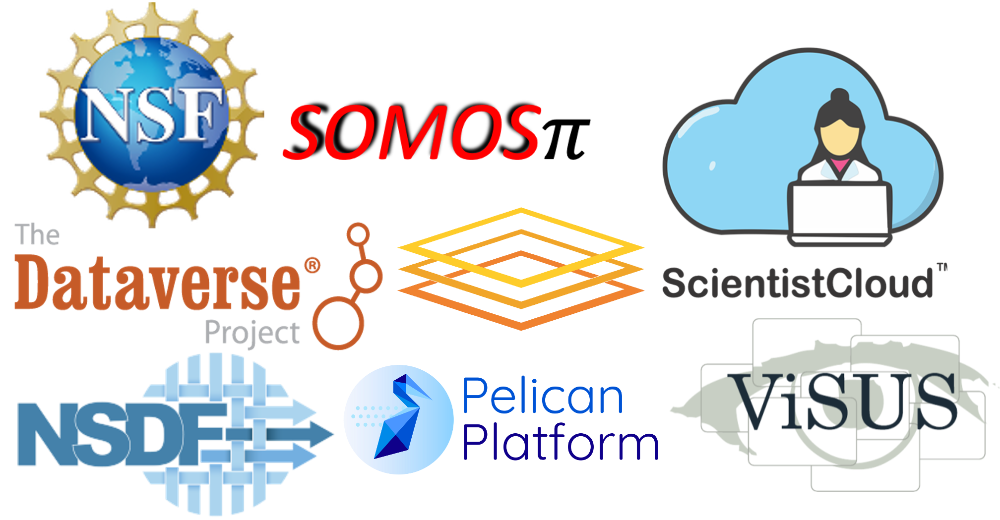
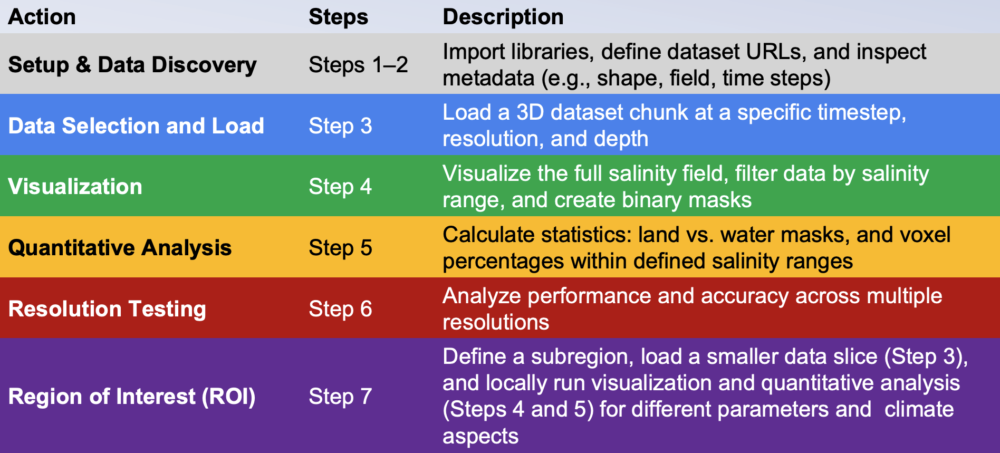
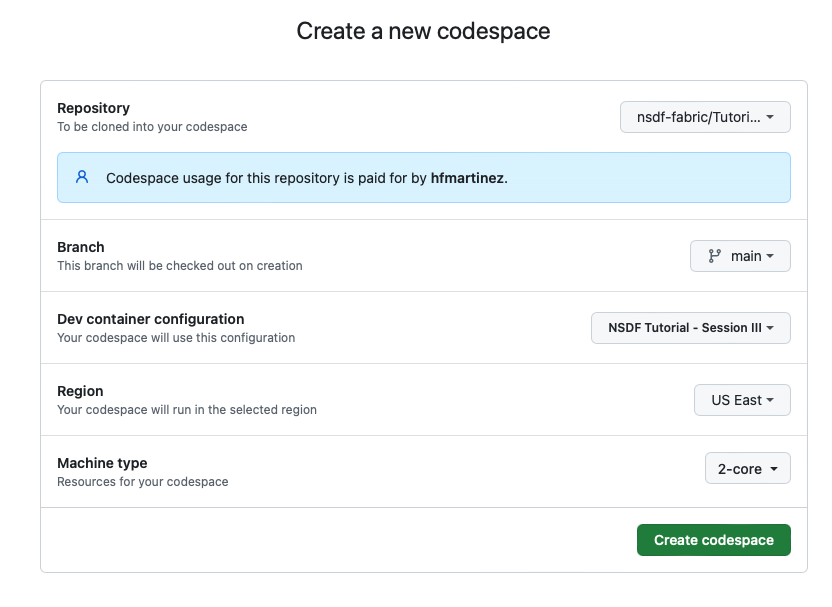
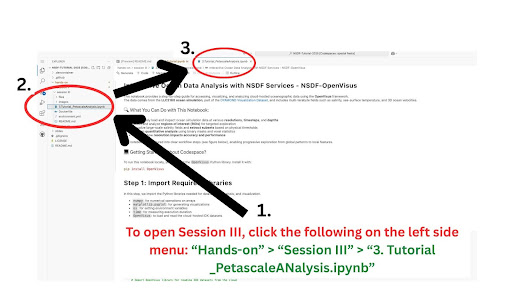
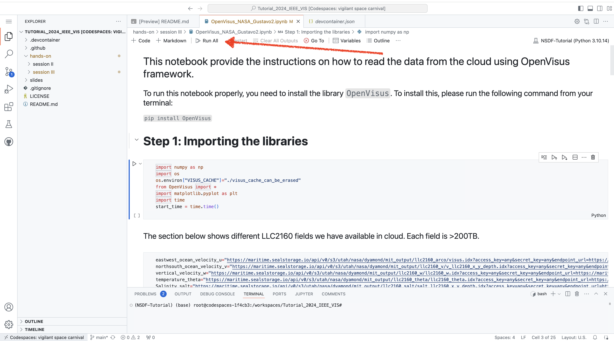
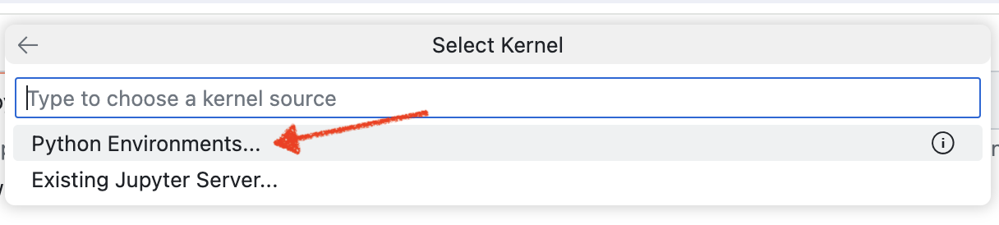
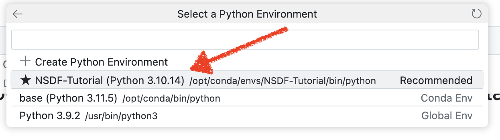
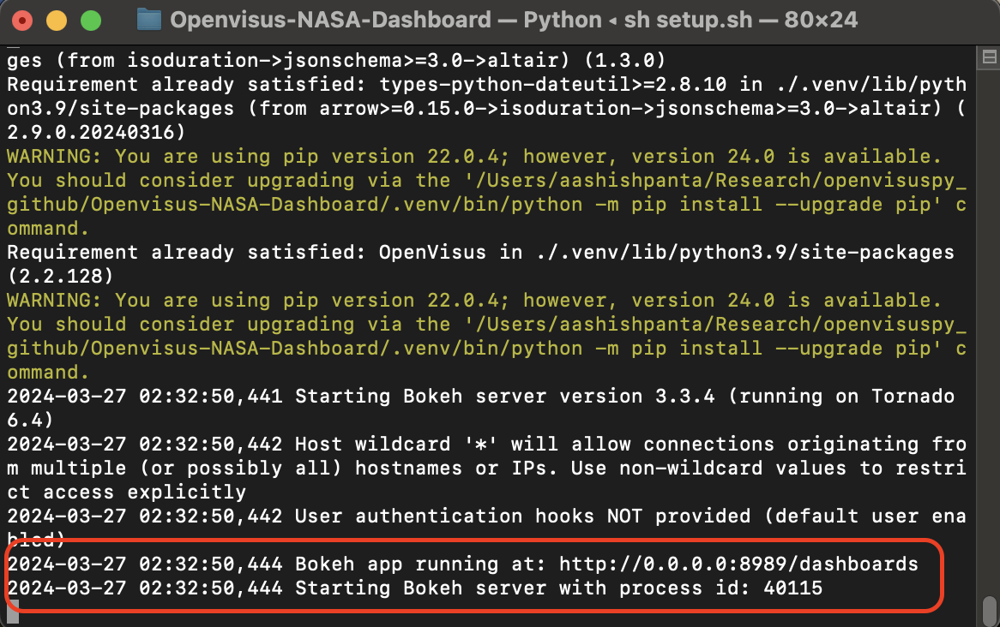
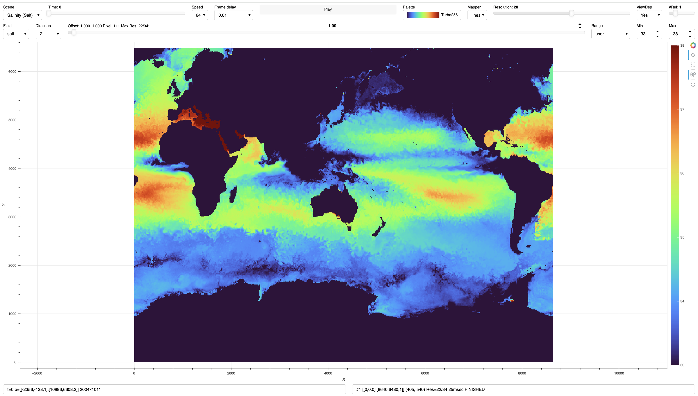
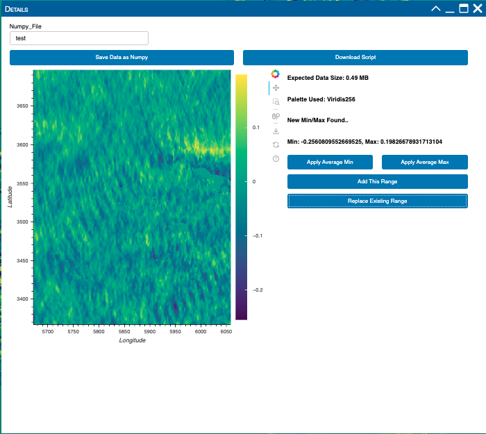

# **NSDF Tutorial: Using NSDF for End-to-End Analysis of Scientific Data - Petascale Ocean Data**

<p align="center">
    
</p>

<p align="center">
<a href="https://www.python.org/downloads/release/python-310/"></a>
<a href="https://opensource.org/licenses/Apache-2.0"></a>
<a href="https://nsdf-workspace.slack.com/"></a>
<a href="https://www.docker.com"></a>
<a href="https://github.com/astral-sh/ruff"></a>
<a href="https://doi.org/10.5281/zenodo.10794642"></a>
<a href="https://dl.acm.org/doi/10.1145/3588195.3595941"></a>
<a href="https://research.ibm.com/publications/enabling-scalability-in-the-cloud-for-scientific-workflows-an-earth-science-use-case"></a>
<a href="https://ieeexplore.ieee.org/document/9041768"></a>
<a href="http://doi.org/10.1145/582034.582036"></a>
<a href="https://www.taylorfrancis.com/chapters/edit/10.1201/b12985-32/visus-visualization-frame[…]a-gyulassy-cameron-christensen-sujin-philip-sidharth-kumar"></a>
<a href="https://doi.org/10.1145/1944846.1944847"></a>
</p>


## Overview

This section of the tutorial introduces access to a petascale climate dataset hosted on the <a href ="https://osg-htc.org/services/osdf"> Open Science Data Federation (OSDF)</a> and distributed across three storage origins. The dataset is accessible through the <a href="https://pelicanplatform.org/"> Pelican platform </a> via direct URLs. It walks users through retrieving the data, performing basic statistical analyses, querying downsampled data for faster exploration, and extracting specific subregions for detailed study using scalable, cloud-native tools.
 
By the end of the tutorial, you will learn how to:

- **Access publicly available petascale datasets** 

- Treat the petascale data as a NumPy array and **perform statistical analysis**

- Use the NSDF dashboard for **large-scale data access, visualization, and analysis**.

<p align="center">
    
    <br>
    <em>Figure 1. Workflow diagram illustrating the tutorial's process of data retrieval, visualization and downsampled analysis using the  NSDF services.</em>
</p>

 ----
 ## Table of contents
 
 1. [Running the Tutorial](#running-the-tutorial)
 2. [Option 1: GitHub Codespaces (Recommended)](#option-1-GitHub-codespaces-recommended)
 3. [Option 2: Local Machine](#option-2-local)
 5. [Community and Resources](#community-and-resources)
 6. [Authors](#authors)
 7. [Related Works](#Related-Works)
 8. [Acknowledgments](#acknowledgments)
 
## Running the Tutorial
### Option 1: GitHub Codespaces (Recommended)

> :bulb: **Note:** To follow this tutorial using the GitHub Codespaces you must have a GitHub Account

Use your GitHub account to run this tutorial with GitHub Codespaces

Please click the next button to open in GitHub Codespaces

[](https://github.com/codespaces/new/TauferLab/NSDF-Tutorial-2025?devcontainer_path=.devcontainer/session+III/devcontainer.json)

Now follow these steps to set up your virtual environment using GitHub codespaces:

Verify that you are using the `main` branch, the repository name `TauferLab/NSDF-Tutorial-2025` and the dev container configuration `NSDF Tutorial - Session III`. Then click on `Create Codespace`

<p align="center">
    
    <br>
    <em>Figure 2. Creating GitHub codespaces.</em>
</p>

> :bulb: **Note:** This process may take a couple of minutes.

<p align="center">
    
    <br>
    <em>Figure 3. Setting up your Codespace.</em>
</p>

This will take you to a GitHub Codespace, which can take upto 3 minutes to install all required dependencies. After this, you will be able to see an interface like this. Now, do the following:

- Browse `hands-on/session III`
- Select the Jupyter Notebook: `3.Tutorial_PetascaleAnalysis.ipynb`. See `Figure 4` below for reference.
- Click 'Run All'. (See images below for reference)
- A popup will apprear asking you to select Kernel. From there, select 'Python Environments'
- Select 'NSDF-Tutorial (Python 3.10.17)'

<figure>
    
    <figcaption>Figure 4. Steps to access the jupyter notbook.</figcaption>
</figure>
</br>

<figure>
    
    <figcaption>Step 3: Select 'Run All'</figcaption>
</figure>
</br>

<figure>
    
    <figcaption>Step 4: Select 'Python Environments'</figcaption>
</figure>
</br>
<figure>
    
    <figcaption>Step 5: Select 'NSDF-Tutorial'</figcaption>
</figure>
</br>

If you are familiar with VS code, you should be able to execute the rest of the code now.
You can explore the jupyter notebooks now.

To launch the dashboard from here, open terminal from the VS code itself and do `sh setup.sh`. This will download other remaining dependencies. It will look like this image [Scroll to Installation](#installation-terminal)


----
### Option 2: Local Machine
#### Basic Pre-requirements
- Download [Python](https://www.python.org/downloads/) version > 3.8 and version< 3.12 depending on your  OS
- Install and setup latest version of [Git](https://git-scm.com/downloads) 


**1. Clone this repository**
- Open the terminal or git bash from your machine and run the following command:
``` git clone  https://github.com/sci-visus/Openvisus-NASA-Dashboard.git```

**2. Run the script**
- After cloning, go inside the repository using `cd Openvisus-NASA-Dashboard` from your terminal.

- If you are using Windows, you can go the folder containing the files, and double-click it. It should open a shell and start running the script.

- If you are using Linux or Mac, you can do `sh setup.sh` to run the script.

- This code uses port `8989` by default. If this port is already in use, please feel free to change it in the first line in the [`setup.sh`](setup.sh) file and run again.

- Once the installation completes, you should see something like this: 
<div id="installation-terminal">
  
 
</div>
It is basically cloning a repo, setting up the environment and installing required dependencies to run the dashboard properly. It could take upto 3 minutes but your internet speed can affect this time.

**3. Visit the Dashboard**
- Once the script runs successfully, you can visit the url [localhost:8989](http://localhost:8989) or [0.0.0.0:8989](http://0.0.0.0:8989) in your browser and start exploring.
- By default, you can see the dashboard that looks like this:


**4. Interactivity**
There are several interactive options available within the dashboard. 

- *Dataset*: you can click dropdown option called `scene` at the topmost left and get a list of dataset available
- *Time*: You can change the timeslider called `Time` to get any timesteps. There are more than 10000 timesteps available from the original simulation.
- *Offset*: You can change the depth of the ocean by changing the `offset` slider. Since this is ocean data, `0` means the sea surface. The depth increases as the offset increases. Total 90 depths available from the original simulation.
- *Resolution*: It lets the users select the quality of the data they want. Lower resolution means coarser data, with low data movement, higher resolution means finer and more detailed data which can be slower.
- *Direction*: This is useful to see the vertical slicing, horizontal slicing or the surface visualization based on user's needs.
- *Play*: There is a `Play` button available that lets the users browse through time. 
- *Speed*: It is the number of timesteps users want to see at a time while `playing`. `1` means every single timestep, `2` means every other timestep and so on.
- *Frame delay*: This allows the users to manually slow down the rate at which data are updated.
- *Palette*: Users can choose from a list of high quality perceptually accurate color palettes depending on their needs. 
- *Range*: This lets the users decide if they want to keep the same range across entire data or dynamically change the range as new timestep or depths comes in. Users can manually set their own range by change the dropdown option to `user` and changing `min` and `max` values in the following boxes.

**5. Subregion Extraction**
We understand that extracting a region from this huge dataset can be extremely useful for certain usecases. So, we have used the bokeh widgets along with Javascript to allow selection of regions within the dashboard. Right next to the colormap, you can see a bokeh toolbar that looks like this:


<p> 

- *Pan*: The top option is called `pan` and its selected by default. You can move the image around while this is clicked. 

- *Selection*: The second option is a `selection` box. After clicking this, you can draw a bounding box on the image anywhere, and this will show the detailed view of that selection region, which is described in the next section below.

- *Zoom*: The third option is the `zoom` button. Its on by default and, users can use their mouse cursor to zoom into a region or zoom out as per their needs.

- *Reset*: If the viewing region is changed at any point because of the use of the buttons above, clicking this will reset the zoom and pan to default.  
</p>

**6. Region of Interest Detailed View**
 When a selection box is clicked from bokeh toolbar and a bounding box is drawn on the image, it queries for the higher resolution data in that selection region. We limit the size to be either 20MB or highest resolution possible without going over this limit. The detailed view looks like this:

 

 Some of the features available in this window are mentioned below:
 - *Download the numpy array*: Users have the option to save the selected data into their local machine as a numpy array. It captures both the data and their relative position in the data nad save it as a `.npz` file which can then  be loaded with `numpy` and can be used anywhere numpy is supported.

 - *Download the python script*: In case the data is large and users dont want to download the data immediately, it lets the users download the python script that can query for the exact region and save them locally in their machine. 

 - *Replace Existing Range*: If the range of the seleted data is different and users think this is more appropriate for the whole dashboard, they can click ` Replace Existing Range` to replace the min/max value in the original dashbaord. For example, if the original dashboard colormap has the range forom `-4` to `4`, and the selected region has range from `-1` to `1` which they believe is more appropriate, clicking this will change the original colormap in the dashboard to `-1`to `1`.

 - *Add This Range*: In other cases where the original dashboard is showing range thats not including the range in detailed view or if users changed the range previously and wants to manually manipulate the range, clicking `Add This Range` will change the min/max in the orginal dashboard ensuring that the new range is included. For example, if the main dashboard is showing range from `-1` to `1`, and users selected a region that had values ranging `-2` to `1.5`, clicking this will update the color range in main dashboard to include highest minima and maxima values, i.e. `-2` to `1.5` in this case.

 - *Detailed Stats*: The detailed view also shows the minimum and amximum value for the selected region. If users want to download the data locally, it also shows the approximate file size. Again, this is set to a 20 MB max so that users don't accidentally download large chunk of data in their local machine without being aware of.

---
## Community and Resources:

NSDF and OpenVisus are open-source projects. Questions, discussions, and contributions are welcome. Contributions can include new packages, bug fixes, documentation, or even new core features.


NSDF Resources:

- **Slack workspace**: [nsdf-workspace](https://nsdf-workspace.slack.com/).
- **Github Discussions**: [issues](https://github.com/nsdf-fabric/catalog-comparison-tool/issues): Discussions and Q&A.
- **Mailing list**: [https://groups.google.com/g/nsdf](https://groups.google.com/g/nsdf) - nsdf@googlegroups.com
- **LinkedIn**: [LinkedIn](https://www.linkedin.com/company/76216771/admin/dashboard/) 

OpenVisus Resources:

- **Github:** [Open Source distribution of the ViSUS capabilities](https://github.com/sci-visus/openvisus)
- **Webpage:** [VISUS - High performance Big Data Analysis and Visualization Solutions](https://visus.org/)
 ---
 ### Authors

 Please feel free to contact us here for detailed information:
  - Aashish Panta [Email me](mailto:aashishpanta0@gmail.com)
  - Giorgio Scorzelli [Email me](mailto:scrgiorgio@gmail.com)
  - Valerio Pascucci [Email me](mailto:pascucci.valerio@gmail.com)

  --- 
  ### Related Works


1. Aashish Panta,Xuan Huang, Nina McCurdy, David Ellsworth, Amy A. Gooch, Giorgio Scorzelli, Hector Torres, Patrice Klein, Gustavo A. Ovando-Montejo, Valerio Pascucci. “Web-based Visualization and Analytics of Petascale data: Equity as a Tide that Lifts All Boats”.  LDAV 2024
2. Pascucci, Valerio, et al. "The ViSUS visualization framework." High Performance Visualization. Chapman and Hall/CRC, 2012. 439-452. [Here](https://www.taylorfrancis.com/chapters/edit/10.1201/b12985-32/visus-visualization-framework-valerio-pascucci-giorgio-scorzelli-brian-summa-peer-timo-bremer-attila-gyulassy-cameron-christensen-sujin-philip-sidharth-kumar)
3. Brian Summa, Giorgio Scorzelli, Ming Jiang, Peer-Timo Bremer, and Valerio Pascucci. 2011. Interactive editing of massive imagery made simple: Turning Atlanta into Atlantis. ACM Trans. Graph. 30, 2, Article 7 (April 2011), 13 pages. [Here](https://dl.acm.org/doi/10.1145/1944846.1944847)

## Acknowledgments

The authors of this tutorial would like to express their gratitude to:

- NSF through the awards 2138811, 2103845, 2334945, 2138296, and 2331152.
- NASA Ames Research Center and NASA JPL
- Open Science Data Federation (OSDF) and Pelican Platform Team

Any opinions, findings, conclusions, or recommendations expressed in this material are those of the author(s) and do not necessarily reflect the views of the National Science Foundation.
